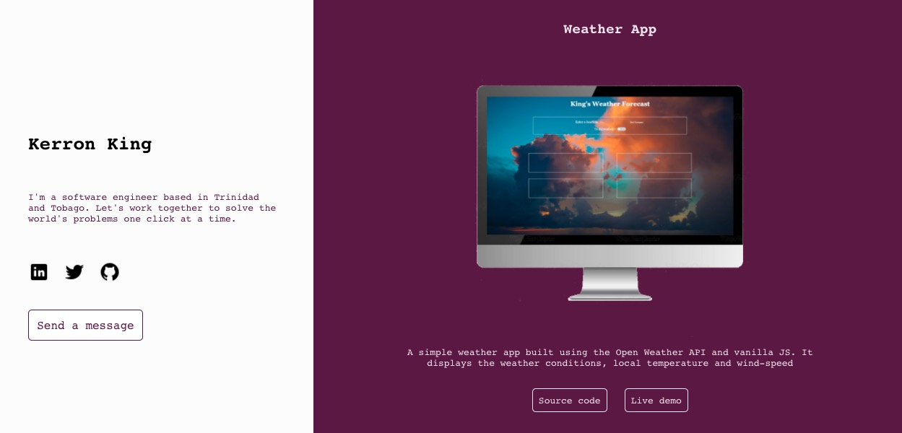

<h1 align="center">Kerron King - Portfolio</h1>

## Table of Contents
* [About](#About)
* [Live Demo](#demo)
* [Installation and Usage](#use)
* [Built With](#built)
* [Contributing](#Contributing)
* [Show Your Support](#show)
* [Author](#Author)

<p align="center">
  
</p>

## About

This is my portfolio site, repo. Take a look around!

## Live Demo <span id="demo"></span>

Click [here](https://kerronking.github.io/kerron-king-portfolio/) to see the live version.

## Installation and Usage <span id="use"></span>

* Open the terminal and clone the repo with the following command:
```
$ git clone https://github.com/KerronKing/kerron-king-portfolio.git
```

* Install the dependencies:
```
$ npm install
```

* To launch the app, cd in the project directory and enter the following commands in the terminal:
```
$ npm start
```

## Built With <span id="built"></span>

This page was built using the following technologies:
- React
- ES6
- CSS3

## Contributing

Contributions, issues and feature requests are welcome!

Feel free to check the [issues](https://github.com/KerronKing/kerron-king-portfolio/issues) page.

## Show your support <span id="show"></span>

Feel free to drop a :+1: to show your support. It'd be greatly appreciated it :pray:

## Authors

:bust_in_silhouette: Kerron King

* Github: [@KerronKing](https://github.com/KerronKing)
* Email: kerronk1989@gmail.com
* Linkedin: [Kerron King](linkedin.com/in/kerron-shawn-king)
